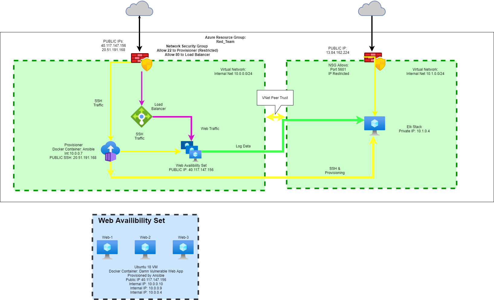
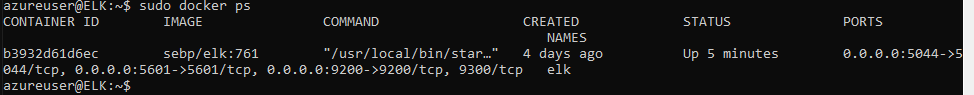

## Automated ELK Stack Deployment

The files in this repository were used to configure the network depicted below.

These files have been tested and used to generate a live ELK deployment on Azure. They can be used to recreate the entire deployment pictured above. Alternatively, select portions of the YAML Playbook file may be used to install only certain pieces of it, such as Filebeat.

  - [FILEBEATS YAML Installation](https://github.com/ealbright98/Ansible-ELK-Stack-Deployment/blob/master/Playbooks/filebeat-playbook.yml)

This document contains the following details:
- Description of the Topology
- Access Policies
- ELK Configuration
  - Beats in Use
  - Machines Being Monitored
- How to Use the Ansible Build

### Description of the Topology

The main purpose of this network is to expose a load-balanced and monitored instance of DVWA, the D*mn Vulnerable Web Application.

Load balancing ensures that the application will be highly available, in addition to the network from Distributed Denial of Service attacks.

Jump box provisioning creates a central point to create and edit VMs/Containers within the Virtual Network will minimizing the attack surface that is open to threats outside of the network. 

Integrating an ELK server allows users to easily monitor the vulnerable VMs for changes to the configuration and system files.
- The system uses FILEBEAT to monitor the log files and configuration file directories on the VMs.  All data is forwarded to the ElasticSearch engine.
- The system uses METRICBEAT to monitor Operating System and Service metric data.  All data is forwarded to the ElasticSearch engine.

The configuration details of each machine may be found below.

| Name     | Function | IP Address | Operating System |
|----------|----------|------------|------------------|
| Jump Box | Gateway  | 10.0.0.7   | Ubuntu 18.04     |
| Web-1    |Web Server| 10.0.0.10  | Ubuntu 18.04     |
| Web-2    |Web Server| 10.0.0.9   | Ubuntu 18.04     |
| Web-3    |Web Server| 10.0.0.4   | Ubuntu 18.04     |

### Access Policies

The machines on the internal network are not exposed to the public Internet. 

Only the Provisioning machine can accept connections from the Internet through the SSH protocol. Access to this machine is only allowed from the following IP addresses:
66.232.202.0/24

Machines within the network can only be accessed by SSH.
SSH access has been limited to the Jump Box Provisioner, 10.0.0.7

A summary of the access policies in place can be found in the table below.

| Name     | Publicly Accessible | Allowed IP Addresses | Protocols Allowed |
|----------|---------------------|----------------------|-------------------|
| Jump Box |       Yes           |    66.232.202.0/24   |       SSH         |
| Web 1-3  |       Yes           |     10.0.0.7         |       HTTP        |
| ELK      |       Yes           |     10.0.0.7         |       SSH         |
| ELK      |       Yes           |    66.232.202.0/24   |       HTTP        |

### Elk Configuration

Ansible was used to automate configuration of the ELK machine. No configuration was performed manually, which is advantageous because:
- the YAML cookbooks can be reused with the expecatation of the same result everytime. 
- the setup is completely isolated from public access minus the specifically allowed access via an IP range.

The playbook implements the following tasks:
- Install Docker, Python-PIP
- Download the image: sebp/elk:761
- Enable the container to start as a service to withstand reboots

The following screenshot displays the result of running `docker ps` after successfully configuring the ELK instance.

### Target Machines & Beats
This ELK server is configured to monitor the following machines:
- 10.0.0.9
- 10.0.0.4
- 10.0.0.10
We have installed the following Beats on these machines:
- Filebeat:
  - Web-1, Web-2, Web-3
- Metricbeat:
  - Elk

These Beats allow us to collect the following information from each machine:
- The filebeat is expected to monitor the log files stored on each webserver.  Events that are recorded from the DVWA server will be transferred to Elasticsearch.
- The Metricbeat is expected to relay to elasticsearch the performance statistics of the ELK server. 

### Using the Playbook
In order to use the playbook, you will need to have an Ansible control node already configured. Assuming you have such a control node provisioned: 

SSH into the control node and follow the steps below:
- Copy the hosts file to /etc/ansible.
- Update the hosts file to include:
  - A group notated by [ groupname ] 
  - A list of machine IP addresses with the path to the python interpreter
- Run the playbook, and navigate to each VM via SSH to check that the installation worked as expected.  The webgui for the ELK stack can also be checked by going to:
  - http://[IP_Address_ELK_VM]:5061/app/kibana

- To use this repo to build your own machine do the following:
  - Use git to pull a copy of the repo
      `git pull https://github.com/ealbright98/Ansible-ELK-Stack-Deployment.git`
  - Copy the config files to the ansible config
      `cp ./Ansible-Elk-Stack-Deployment/Configs/. /etc/ansible/`
  - Copy the playbooks to an accessible folder:
      `cp ./Ansible-Elk-Stack-Deployment/Playbooks/. /etc/ansible/files/`
  - Use your favorite text editor to update the hosts file
      `sudo nano /etc/ansible/hosts`
  - Let Ansible do its job and provisision the machines
      `ansible-playbook /etc/ansible/etc/files/install-elk.yml`
      `ansible-playbook /etc/ansible/etc/files/filebeat-playbook.yml`
      `ansible-playbook /etc/ansible/etc/files/metricbeat-playbook.yml`
